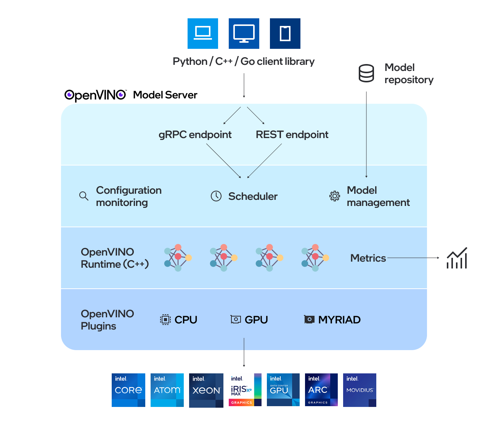

# Сравнение развертывания модели классификации эмоций: OpenVINO Model Server vs Triton

[OpenVINO Model Server](https://github.com/openvinotoolkit/model_server) и [NVIDIA Triton Inference Server](https://docs.nvidia.com/deeplearning/triton-inference-server/user-guide/docs/index.html) - это два популярных решения для развертывания моделей машинного обучения. В данном проекте мы сравниваем их производительность и удобство использования на примере модели классификации эмоций в русcкоязычных текстах.

## OVMS Architecture:


## Triton Architecture:


## Различия между OpenVINO Model Server и NVIDIA Triton Inference Server:

| Характеристика | OpenVINO Model Server | NVIDIA Triton Inference Server |
|-----------------|-----------------------|---------------------------------|
| Производитель | Intel | NVIDIA |
| Основное назначение | Оптимизирован для инференса на CPU и Intel-ускорителях. | Оптимизирован для инференса на GPU и поддерживает широкий спектр аппаратуры. |
| Целевая аудитория | Пользователи Intel-хардвера (например, CPU, VPU, FPGA). | Пользователи GPU NVIDIA, но также поддерживаются CPU. |
| Форматы моделей | OpenVINO IR, ONNX, TensorFlow, PyTorch, PaddlePaddle, JAX/Flax | TensorRT, ONNX, TensorFlow, PyTorch, OpenVINO, Python, DALI, FIL, vLLM |
| Оптимизация производительности | Использует OpenVINO Toolkit для ускорения инференса на Intel-хардвере. | Поддерживает оптимизацию моделей через TensorRT для GPU. |
| Масштабирование | Масштабируется с использованием Kubernetes и Docker. | Есть встроенные механизмы масштабирования и оптимизации распределения нагрузки. |


## Архитектура
Проект состоит из следующих компонентов:

1. Модель классификации эмоций в русcкоязычных текстах
2. Конфигурации развертывания для:
- OpenVINO Model Server
- NVIDIA Triton Inference Server
3. Kubernetes манифесты для мониторинга
4. Скрипты для нагрузочного тестирования (TBD)

## Предварительные требования

- Kubernetes кластер (minikube, kind, k3s, etc.)
- kubectl
- Docker
- Python 3.8+

## Порядок развертывания модели на OpenVINO Model Server

1. Применить манифест для minio:
```bash
kubectl apply -f k8s/minio.yaml
```
2. Пробросить порт для доступа к Minio:
```bash
kubectl port-forward svc/minio-service 9001:9001
minikube service minio --url # Получить URL для доступа к Minio
```
3. Конвертировать модель в формат OpenVINO IR:
```bash
python ov_convert.py
```
4. Загрузить модель в Minio через веб-интерфейс, используя URL из шага 2:
- Создать бакет `models`
- Загрузить архив с моделью, полученной на шаге 3, в бакет `models`
5. Применить манифест для развертывания OpenVINO Model Server:
```bash
kubectl apply -f k8s/ovms/ovms.yaml
```
6. Применить манифест для развертывания Prometheus и Grafana:
```bash
kubectl apply -f k8s/ovms/monitoring/prometheus.yaml
kubectl apply -f k8s/ovms/monitoring/grafana.yaml
```
7. Добавить дашборд в Grafana для OpenVINO Model Server через Web-интерфейс (http://localhost:3000), используя файл `k8s/ovms/monitoring/grafana_dashboard.json`
8. Запустить инференс:
```bash
python infer_grpc.py --port 57243 "What a wonderful day!" # GRPC
python infer_rest.py --port 8080 "What a wonderful day!" # REST
```

## Порядок развертывания модели на Triton Inference Server

Требуется поместить файл конфигурации `config.pbtxt` вместе с моделью в Minio (будем использовать onnx бэкенд).

Порядок идентичен развертыванию для OpenVINO Model Server, за исключением шагов 3 и 5:

3. Конвертировать модель в формат ONNX:
```bash
python onnx_convert.py
```
5. Применить манифест для развертывания Triton Inference Server:
```bash
kubectl apply -f k8s/triton/triton.yaml
```

Дашборд для Triton Inference Server можно добавить через Web-интерфейс Grafana, используя ID: [12832](https://grafana.com/grafana/dashboards/12832-triton-inference-server/).

## Полезные ссылки:

1. [Inference Scaling with OpenVINO™ Model Server in Kubernetes and OpenShift Clusters](https://www.intel.com/content/www/us/en/developer/articles/technical/deploy-openvino-in-openshift-and-kubernetes.html)
2. [OpenVINO Cheet Sheet](https://docs.openvino.ai/2024/_static/download/OpenVINO_Quick_Start_Guide.pdf)
3. [OpenVINO Model Server Documentation](https://docs.openvino.ai/2024/openvino-workflow/model-server/ovms_what_is_openvino_model_server.html)
4. [Triton Architecture](https://docs.nvidia.com/deeplearning/triton-inference-server/user-guide/docs/user_guide/architecture.html)
